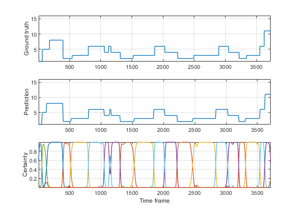

# TemporalNeuralNet
A modular deep learning model for multivariate time series. Originally built for the kinematical channels of the JIGSAWS surgical dataset, but the architecture is generic.

The pipeline is:
- 1-D temporal CNN module (Conv+Pool layers) on each input channel for feature extraction
- Recurrent module (vanilla RNN, GRU, and LSTM units) for temporal modelling
- Fully-connected classifier for final predictions
    
All modules and layers are optional, but the order CNN $\rightarrow$ RNN $\rightarrow$ FC is fixed.
  

## Key methods:
- **net = TemporalNeuralNet(testData, Name,Value, ...)** \
  Constructs the network with the layer configurations specified by name-value pairs using He initialization and initializes training metrics using the validation set (`testData`).

- **networkOutput = net.forward(obj, inputSequence)** \
  Runs the forward propagation on a raw input sequence of size (T×C). Returns `[numSteps×numClasses]` softmax probabilities.

- **net.train(obj, trainingData, testData, epochs, batchSize, 'numSegments',S)**
  Trains the network with backpropagation through time (BPTT) using Adam optimizer. Data sequences can be segmented into `numSegments` base segments for a total of `4 * numSegments - 3` overlapping training segments. Recurrent unit memory is reset between segments. \
  I couldn't find the detailed backpropagation calculations for RNN, LSTM and GRU anywhere online, so I included them here: [Backprop Through Time — calculations](docs/BPTTcalculations.pdf)

- **acc = net.evaluate(obj, testData)**\
  Computes classification accuracy on a test dataset.

For a detailed explanation of configurations and inputs/outputs, see the header of `TemporalNeuralNet` and the `demo` script.
  

## Data format:
trainingData/testData: `N×2` cell array. Each row: `{ sequence, labels }`\
where: &ensp; sequence: `[T×C]` double/single (time × channels)\
&emsp;&emsp;&emsp; &ensp; labels: &emsp;&nbsp; `[T×K]` one-hot encoded matrix (K = numClasses)
  

## Demo:
For a quick demonstration with syntetic data generation, run `demo.m`.\
The classifier scales well to real data (e.g., surgical gesture recognition with hundreds of thousands of parameters); see the figure below.

  

## Requirements

MATLAB R2020b+ recommended (uses inputParser, object-oriented classes, cellfun heavily). No toolboxes required.
