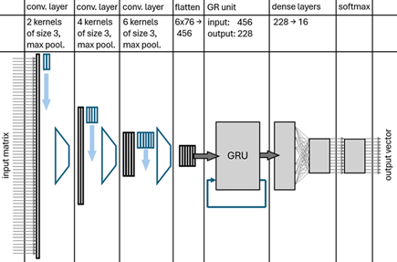

# TemporalNeuralNet
A modular deep learning framework for multivariate time-series classification in MATLAB. Combines temporal convolutional feature extraction, recurrent sequence modelling, and fully connected classification into a configurable pipeline for supervised learning on sequential data.

The architecture pipeline is:
- Temporal CNN module (Convolutional and max-pooling layers) on each input channel for feature extraction
- Recurrent module (vanilla RNN, GRU, and LSTM units) for temporal modelling
- Fully-connected classifier for final predictions
    
All modules and layers are optional, but the order CNN $\rightarrow$ RNN $\rightarrow$ FC is fixed.
  

## Key methods:
- **Construct a network:** `net = TemporalNeuralNet(validationData, Name,Value, ...)` \
  Constructs the network with the layer configurations specified by name-value pairs using He initialization and initializes training metrics using the validation set (`validationData`). See `TemporalNeuralNet.m` and `demo.m` for details and examples.

- **Forward pass:** `networkOutput = net.forward(inputSequence)` \
  Runs forward inference on a raw input sequence of size `[numSteps×numChannels]`, and returns `[numSteps×numClasses]` softmax probabilities.

- **Training:** `net.train(trainingData, validationData, epochs, batchSize, 'numSegments',S)` \
  Trains the network with backpropagation through time (BPTT) and Adam optimizer using parallel execution. Data sequences can be segmented into `numSegments` base segments for a total of `4 * numSegments - 3` overlapping training segments. Recurrent unit memory is reset between segments. \
  Detailed backpropagation calculations for RNN, LSTM and GRU can be found [here](docs/BPTTcalculations.pdf).

- **Evaluation:** `acc = net.evaluate(testData)` \
  Computes classification accuracy on a test dataset.

For a detailed explanation of configurations and inputs/outputs, see the header of `TemporalNeuralNet` and the `demo` script.
  

## Included Layers:
### CNN Module: ###
- **ConvolutionalLayer:** 1D temporal convolutions with leaky-ReLU activations

- **PoolingLayer:** Temporal max pooling with non-overlapping pooling windows

### Recurrent Units ###
- **RecurrentUnit:** Vanilla recurrent neural network with recurrent hidden state, leaky-ReLU activations and truncated BPTT

- **GRUnit:** Gated recurrent unit with update gate, reset gate, candidate hidden state sigmoid and tanh activations

- **LSTMUnit:** Long short-term memory unit with forget gate, input gate, output gate, sigmoid and tanh activations

### Fully Connected Network ###
- Classifier head with arbitrary depth and leaky-ReLU activations

## Parallel Training:
Mini-batch gradient computation is parallelized using `parfor`. Each worker computes local gradients which are aggregated before optimizer updates, substantially improving training throughput on large datasets.

## Data format:
training/validation/test Data: `N×2` cell array. Each row: `{ sequence, labels }`\
where: &ensp; sequence: `[T×C]` multichannel time-series (time × channels)\
&emsp;&emsp;&emsp; &ensp; labels: &emsp;&nbsp; `[T×K]` one-hot encoded labels
  

## Demo:
For a quick demonstration with syntetic data generation, run `demo.m`.\
The classifier scales well to real data and has been tested on larger real-world sequence classification tasks with networks containing millions of parameters.

## Requirements:

MATLAB R2020b+ recommended (uses inputParser, object-oriented classes, cellfun heavily).

Parallel Computing Toolbox needed.

## Notes:
This project intentionally implements all core operations manually rather than relying on MATLAB Deep Learning Toolbox abstractions. The goal is transparency, experimentation, and educational value in addition to practical sequence modelling.
