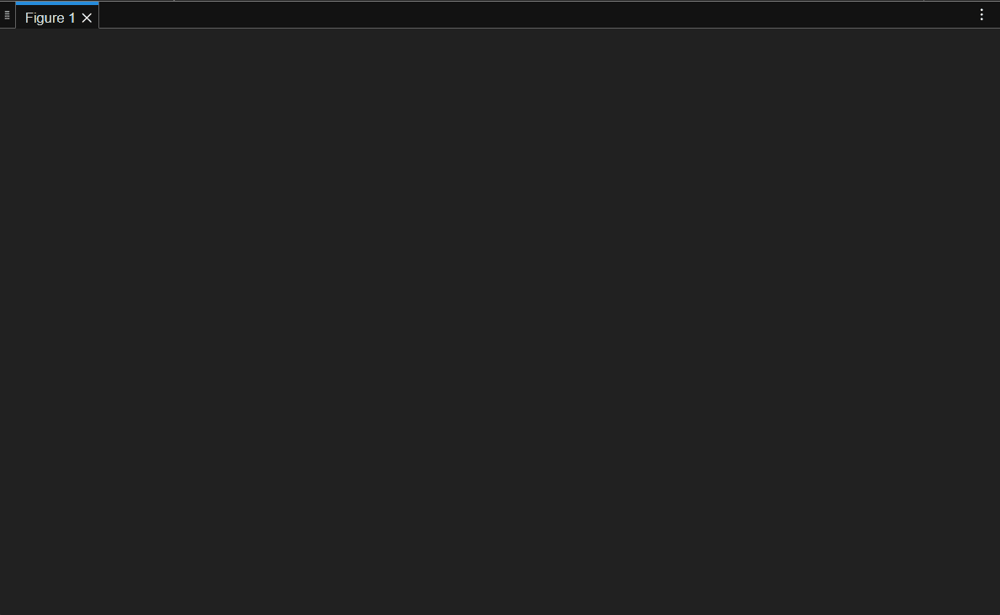
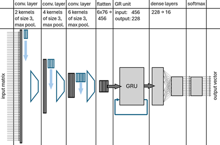

# TemporalNeuralNet
A modular deep learning framework for multivariate time-series modelling in MATLAB. Combines temporal convolutional feature extraction, recurrent sequence modelling, and a fully-connected head into a configurable pipeline, shared by two tasks: **sequence classification** (`Classifier`) and **multi-step forecasting** (`Predictor`).
 
The architecture pipeline is:
- Temporal CNN module (Convolutional and max-pooling layers) on each input channel for feature extraction
- Recurrent module (vanilla RNN, GRU, and LSTM units) for temporal modelling
- Fully-connected head for final predictions (classification logits or forecasted values)
All modules and layers are optional, but the order CNN $\rightarrow$ RNN $\rightarrow$ FC is fixed. `Classifier` and `Predictor` both inherit this shared backbone from an abstract `TemporalNeuralNet` base class, and differ only in their loss, targets, and output activation.
 
  

  

Demo: CNN-GRU-FC architecture learning to distinguish three classes from synthetic data.

## Architecture:
 
`TemporalNeuralNet` is an abstract base class holding everything identical between the two tasks: layer construction, the Adam optimizer, and the shared CNN→RNN→FC forward pass. It cannot be instantiated directly.
 
- **`Classifier < TemporalNeuralNet`** — dense, per-timestep sequence labeling. Every timestep in the input gets its own predicted class, trained with weighted cross-entropy (weighted by inverse label frequency, to counter class imbalance).
- **`Predictor < TemporalNeuralNet`** — autoregressive multi-step forecasting. Trained with MSE loss against the true next raw value and evaluated via a genuine autoregressive rollout, feeding each step's own prediction back in as input for the next.

## Key methods:
- **Construct a network:**
  `net = Classifier(trainingData, Name,Value, ...)` or `net = Predictor(validationData, Name,Value, ...)` \
  Constructs the network with the layer configuration specified by name-value pairs (`'CNN'`, `'RNN'`, `'FC'`, `'tPool'`, `'eta'`, ...) using He initialization, plus task-specific options (`'numClasses'` for `Classifier`; `'numChannels'`, `'forecastLength'`, `'trainingLength'`, `'numAutoregressiveSteps'` for `Predictor`). Initializes training metrics from the given dataset. See `TemporalNeuralNet.m`, `Classifier.m`, `Predictor.m`, and `demo.m` for details and examples.

- **Forward pass:** `networkOutput = net.forward(inputSequence)` \
  Runs a single dense forward pass on a raw input sequence of size `[numSteps×numChannels]`. For `Classifier` this is the full prediction: `[numSteps×numClasses]` softmax probabilities. For `Predictor` it's teacher-forced next-step prediction, one row per input step — see `forecast()` below for genuine multi-step rollout.

- **Forecasting (Predictor only):** `networkOutput = net.forecast(inputData, 'forecastLength',F, 'segmentLength',L)` \
  Autoregressive multi-step forecast: takes `L` steps of true context, then rolls forward `F` steps, feeding each prediction back in as input for the next. Accepts either a single raw sequence or a cell array of independent trials (one entry in, one entry out, matching shape).

- **Training:** `net.train(trainingData, validationData, epochs, batchSize, Name,Value, ...)` \
  Trains the network with backpropagation through time (BPTT) and Adam optimizer using parallel execution.
  - `Classifier`: `'numSegments',S` segments each trial into `S` base segments for a total of `4*S − 3` overlapping training segments.
  - `Predictor`: `'numAutoregressiveSteps',N` chains `N` teacher-forced steps per training window, each step's context rolled forward using the network's own prior prediction; gradients from all `N` steps are summed before one Adam update. `'lastStepsOnlyLoss',true` restricts the loss to the steps actually affected by the network's own predictions rather than every step in every window, which empirically trains more stably for `N>1` — see `Predictor.m`'s `train()` docstring for exactly how gradient does (and does not) flow across autoregressive steps.

Recurrent unit memory is reset between segments. Detailed backpropagation calculations for RNN, LSTM and GRU can be found [here](docs/BPTTcalculations.pdf).

- **Evaluation:**
  `acc = net.evaluate(testData)` (`Classifier`) computes classification accuracy.
  `MAE = net.evaluate(testData, forecastLength, segmentLength)` (`Predictor`) computes mean absolute forecasting error over a genuine autoregressive rollout (not teacher-forced).

For a detailed explanation of configurations and inputs/outputs, see the header and per-method docstrings of `TemporalNeuralNet.m`, `Classifier.m`, `Predictor.m`, and the demo/test scripts.
  

## Included Layers:
### CNN Module: ###
- **ConvolutionalLayer:** 1D temporal convolutions with leaky-ReLU activations
- **PoolingLayer:** Temporal max pooling with non-overlapping pooling windows
### Recurrent Units ###
- **RecurrentUnit:** Vanilla recurrent neural network with recurrent hidden state, leaky-ReLU activations and truncated BPTT
- **GRUnit:** Gated recurrent unit with update gate, reset gate, candidate hidden state sigmoid and tanh activations
- **LSTMUnit:** Long short-term memory unit with forget gate, input gate, output gate, sigmoid and tanh activations
### Fully Connected Network ###
- Arbitrary-depth head with leaky-ReLU activations; classification logits or regression outputs depending on the task

<!--

  

-->

## Parallel Training:
Mini-batch gradient computation is parallelized using `parfor`. Each worker computes local gradients which are aggregated before optimizer updates, significantly improving training throughput on large datasets.

<!--
## Gradient Checking:
`GradientCheck.m` runs numerical (finite-difference) gradient checks against every layer type — `RecurrentUnit`, `GRUnit`, `LSTMUnit`, `FullyConnectedNetwork`, `ConvolutionalLayer`, `PoolingLayer` — as well as `Predictor`'s multi-step autoregressive training accumulation, comparing the analytic backprop gradient against a central-difference approximation for a random sample of weights per layer. Useful as a regression check after modifying any layer's forward/backward pair, or after adding a new layer type.
-->

## Data format:
 
**Classification** (`Classifier`) — training/validation/test data: `N×2` cell array. Each row: `{ sequence, labels }`\
where: &ensp; sequence: `[T×C]` multichannel time-series (time × channels)\
&emsp;&emsp;&emsp; &ensp; labels: &emsp;&nbsp; `[T×K]` one-hot encoded labels, one per raw timestep (dense/sequence labeling)
 
**Forecasting** (`Predictor`) — training/validation/test data: `N×1` (or `N×2`, second column unused) cell array. Each row is one independent trial, `[T×C]`. A single multichannel series (e.g. several related channels/sensors) can be one trial with `C>1`; treating each channel as its own independent trial instead (`C=1`, `N` trials) trades shared cross-channel information for more independent training data.

## Demo:
For a quick classification demonstration with syntetic data generation, run `demo.m`.\
The classifier scales well to real data and has been tested on larger real-world sequence classification tasks with networks containing millions of parameters. The forecaster is newer, validated so far on real-world macroeconomic (inflation) forecasting.

## Requirements:

MATLAB R2020b+ recommended (uses `inputParser`, object-oriented classes with abstract base classes, `cellfun` heavily).

Parallel Computing Toolbox needed.

